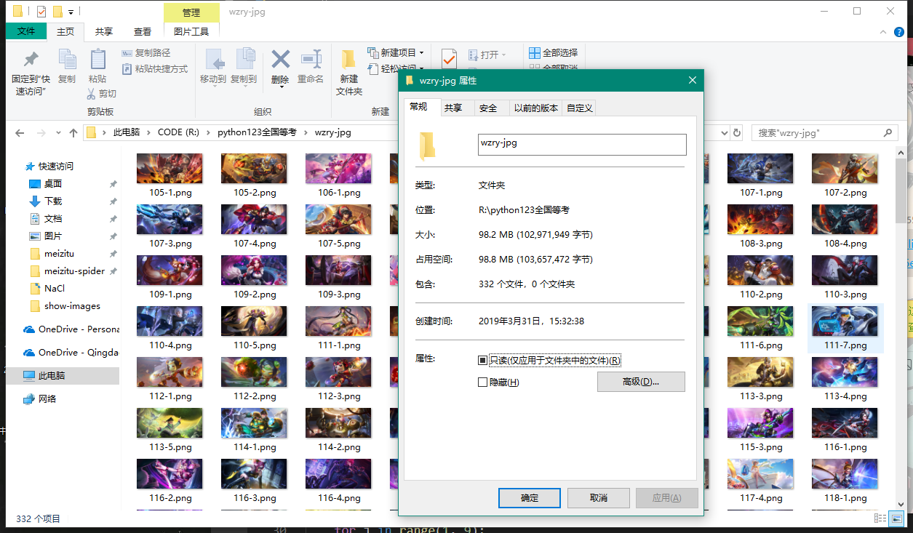
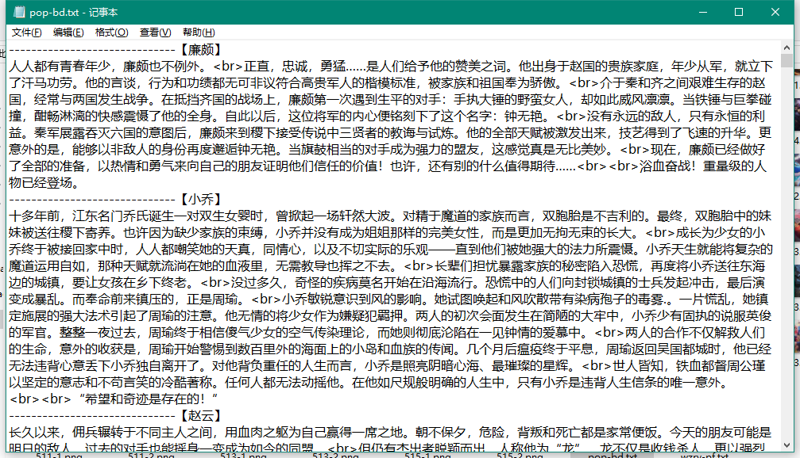
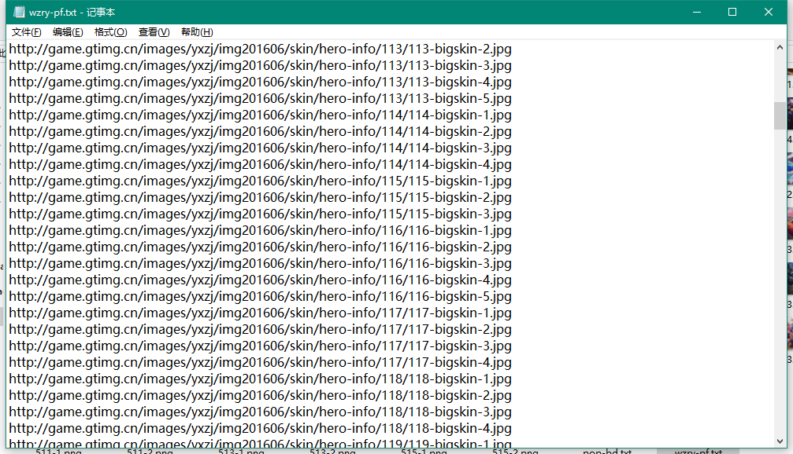

# wzry-spider
### python通用爬虫-通用爬虫爬取静态网页，面向小白
### 基本上纯python语法切片索引，少用到第三方爬虫网络库
### 这是一只小巧方便，强大的爬虫，由python编写
### 主要实现了：
### 1.**爬取高清皮肤大图**
### 2.**爬取所有英雄背景故事** 
#### 所需的库有
- 1. **requests 只用来发送请求和保存二进制文件**

#### 纯python爬虫，利用python索引切片文件读写不依赖第三方网络爬虫库实现硬核爬虫

### 完整项目放在GitHub：[https://github.com/Ymy214/meizitu-spider](https://github.com/Ymy214/wzry-spider)


## 具体实现思路：
- 1. **分析网页源代码结构**
- 2. **找到合适的入口**
- 3. **穷举访问并解析**
- 4. **爬取所有英雄所有皮肤图片**

## 代码思路/程序流程：
**我分析王者荣耀网站上面的英雄资料库发现所有英雄的页面基本上都是连贯的，并且还是偏向与静态网页没有过多的JavaScript渲染，所以比较适合来一波穷举遍历爬虫，但是速度也很快。利用python语法字符串操作，列表操作，字典操作等等循环遍历英雄页面利用python列表切片索引和字符串拼接等等方法来解析HTML得到皮肤图片链接和背景故事文本，将皮肤图片二进制文件保存为png高清大图，将所有英雄背景故事合并保存为文本文档**

## 下面是功能以及效果展示

### 整体展示


### 爬取效果展示-丰功伟绩


### 爬取效果展示-硕果累累


### 背景故事


### 所有图片链接写入文本文件

### 代码展示
### 王者荣耀【皮肤高清大图爬虫】源代码如下
```python
#!/usr/bin/env python
# -*- encoding: utf-8 -*-

import requests
fo = open('./wzry-jpg/wzry-pf.txt', 'w')


path = './wzry-jpg/'
ls = []     
for i in range(105,200):
    url = "http://game.gtimg.cn/images/yxzj/img201606/skin/hero-info/{0}/{0}-bigskin-1.jpg".format(i)
    status_code = requests.request('get', url).status_code
    if status_code != 200:
        continue
    for j in range(1, 9):
        imgurl = url[:-5] + '{}.jpg'.format(j)
        response = requests.request('get', imgurl)
        if response.status_code != 200:            
            continue
        ls.append(imgurl)
        ##下载
        print("开始下载第{}-{}个英雄皮肤图片>>>".format(i,j), end='')
        with open(path+str(i)+'-'+str(j)+'.png', 'wb') as f:
            f.write(response.content)
            print('======下载完成======')

    
for i in range(501,516):
    url = "http://game.gtimg.cn/images/yxzj/img201606/skin/hero-info/{0}/{0}-bigskin-1.jpg".format(i)
    status_code = requests.request('get', url).status_code
    if status_code != 200:
        continue
    for j in range(1, 9):
        imgurl = url[:-5] + '{}.jpg'.format(j)
        response = requests.request('get', imgurl)
        if response.status_code != 200:            
            continue
        ls.append(imgurl)
        ##下载
        print("开始下载第{}-{}个英雄皮肤图片>>>".format(i,j), end='')
        with open(path+str(i)+'-'+str(j)+'.png', 'wb') as f:
            f.write(response.content)
            print('======下载完成======')
##print(ls)
        
##连接写入txt文件
for line in ls:
    fo.write(line+'\n')
fo.close()


```
### 王者荣耀【英雄背景故事爬虫】源代码如下
```python
#!/usr/bin/env python
# -*- encoding: utf-8 -*-

import requests
fo = open('R:/python123全国等考/wzry-jpg/pop-bd.txt', 'w')


ls = []     
for i in range(105,200):
    url = "https://pvp.qq.com/web201605/herodetail/{}.shtml".format(i)
    r = requests.request('get', url)
    if r.status_code != 200:
        continue
    r.encoding = 'gbk'
    name = r.text.split('cname')[1].split(',')[0].split("'")[1]
    text = r.text.split('pop-bd')[1].split('p>')[1][:-2]
    print("开始保存第{}个英雄背景故事>>>".format(i))
    fo.write('【'+name+'】'+'\n'+text+'\n'+'-'*30)

for i in range(501,516):
    url = "https://pvp.qq.com/web201605/herodetail/{}.shtml".format(i)
    r = requests.request('get', url)
    if r.status_code != 200:
        continue
    r.encoding = 'gbk'
    name = r.text.split('cname')[1].split(',')[0].split("'")[1]
    text = r.text.split('pop-bd')[1].split('p>')[1][:-2]
    print("开始保存第{}个英雄背景故事>>>".format(i))
    fo.write('【'+name+'】'+'\n'+text+'\n'+'-'*30)

##连接写入txt文件

fo.close()

        


```

## 另外本人还有面下给小白的
- 1. **反防盗链爬取妹子图**
- 2. **王者荣耀背景故事爬虫**
### 欢迎学习支持
### 有用或帮到你的话不妨点个star我将感激不尽